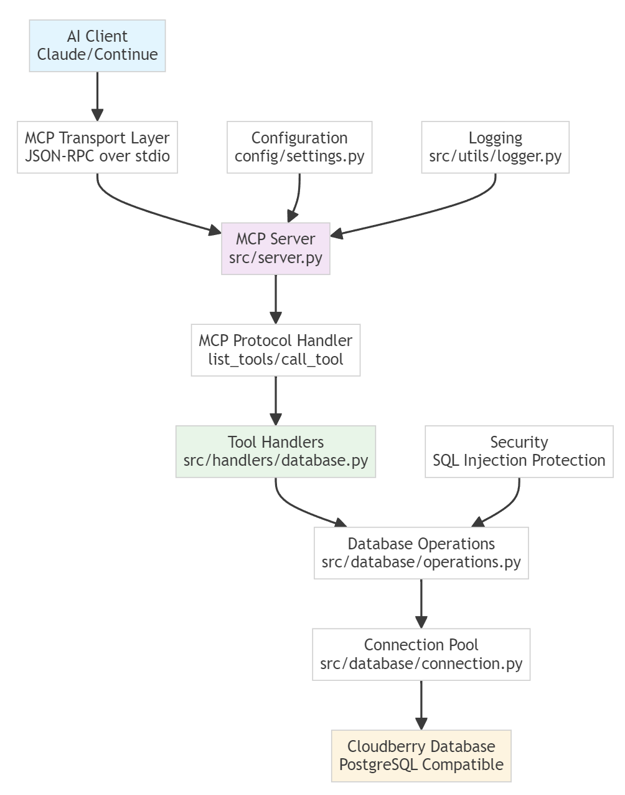

# 🚀 Cloudberry MCP Server

**Author: Vance Chen**

A Model Context Protocol (MCP) server for secure and efficient access to Cloudberry Database, designed for AI applications.



## 📁 Project Structure

```
cbdb_mcp/
├── pyproject.toml          # UV project configuration
├── .env.example           # Environment variables template
├── .gitignore             # Git ignore rules
├── README.md              # Project documentation
├── config/
│   ├── __init__.py
│   └── settings.py        # Configuration management
├── src/
│   ├── __init__.py
│   ├── server.py          # MCP server entry point
│   ├── handlers/          # MCP tool handlers
│   │   └── __init__.py
│   ├── database/
│   │   ├── __init__.py
│   │   └── connection.py  # Database connection management
│   └── utils/
│       ├── __init__.py
│       └── logger.py      # Logging utilities
└── tests/                 # Test suite
    └── __init__.py
```

## 🛠️ Installation & Setup

### 1. Install Dependencies with UV

```bash
# Install UV (if not already installed)
curl -LsSf https://astral.sh/uv/install.sh | sh

# Install project dependencies
uv sync

# Install development dependencies
uv sync --extra dev
```

### 2. Configure Environment Variables

Copy the environment template and configure your settings:

```bash
cp .env.example .env
```

Edit `.env` with your Cloudberry database credentials:

```env
# Cloudberry Database Configuration
CBDB_HOST=your_cloudberry_host
CBDB_PORT=5432
CBDB_DATABASE=your_database_name
CBDB_USER=your_username
CBDB_PASSWORD=your_password
CBDB_POOL_SIZE=10
CBDB_TIMEOUT=30

# MCP Server Configuration
MCP_SERVER_NAME=cloudberry-mcp
MCP_VERSION=1.0.0

# Logging Configuration
LOG_LEVEL=INFO
LOG_FORMAT=json
```

## 🎯 Core Features

### 1. Configuration Management
- Environment variables and configuration file support
- Secure credential management
- Type-safe settings with validation

### 2. Database Connection
- Thread-safe connection pool
- Health check mechanism
- Automatic reconnection
- Connection lifecycle management

### 3. MCP Tools (Planned)
- Secure SQL query execution
- Schema inspection
- Database health monitoring
- Data exploration utilities

### 4. Security Features
- Multi-layer SQL injection protection
- Configuration encryption
- Connection timeout management
- Sensitive data masking

## 🔧 Technology Stack

- **Package Management**: UV (Modern Python packaging)
- **MCP Framework**: mcp (Official Python SDK)
- **Database Driver**: psycopg2-binary (PostgreSQL protocol compatible)
- **Configuration**: pydantic-settings
- **Logging**: structlog
- **Security**: cryptography

## 📊 Development Status

### ✅ Completed
- Project architecture
- Configuration system
- Database connection management
- Structured logging system

### 🚧 In Progress
- MCP server core
- Tool handlers
- Database operations layer

### 📋 Planned
- SQL query execution tools
- Schema inspection tools
- Database monitoring tools
- Comprehensive test suite

## 🚀 Usage

1. Ensure Cloudberry Database is running
2. Configure environment variables
3. Start the MCP server:

```bash
# Method 1: Run as a module
python -m src.server

# Method 2: Run using the installed script (after installation)
pip install -e .
cloudberry-mcp
```

## 🔒 Security

- All SQL queries are parameterized
- Sensitive configuration is encrypted
- Read-only operations by default
- Multi-layer security validation

## 🎪 AI Integration

### Supported Platforms
- Claude Desktop
- Continue.dev
- Custom Python applications

### Integration Example
```python
from mcp.client import MCPClient

client = MCPClient("cloudberry-mcp")
result = await client.call_tool("execute_query", {
    "query": "SELECT * FROM users LIMIT 10"
})
```

## 📖 Documentation

- [Architecture Guide](ARCHITECTURE.md)
- [API Reference](docs/api.md)
- [Security Guide](docs/security.md)
- [Contributing Guide](CONTRIBUTING.md)

## 🤝 Contributing

1. Fork the repository
2. Create your feature branch
3. Commit your changes
4. Push to the branch
5. Create a Pull Request

## 📄 License

Apache License 2.0 